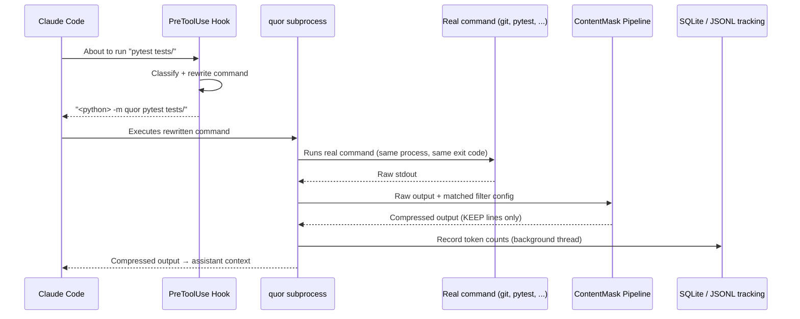
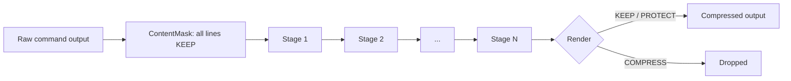
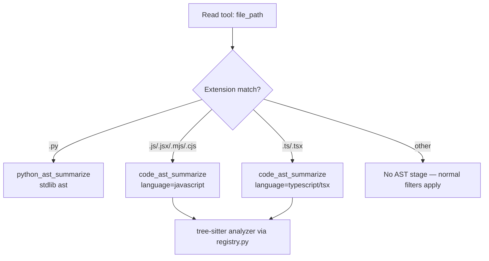

# Quor Architecture

> Audience: a new contributor or product manager who has never seen Quor before. For product
> history and roadmap, see [`backlog.md`](../backlog.md). For the reasoning behind specific
> decisions, see [`docs/final/DECISIONS.md`](final/DECISIONS.md).

---

## 1. What Quor Is

**In plain terms:** Quor sits quietly between an AI coding assistant (Claude Code) and your
terminal. Every time the assistant runs a command like `pytest` or `git status`, Quor intercepts
the output, strips out the parts that carry no useful information (hundreds of identical `PASSED`
lines, unchanged file listings, ANSI color noise), and hands the assistant a shorter version. The
command itself always runs exactly as it normally would — nothing about its behavior, permissions,
or exit code changes. Only what gets *reported back into the assistant's context window* changes.

**Technical details:** Quor is a pure-Python, pip-installable CLI (`quor` / `qr`) that registers as
a Claude Code `PreToolUse` hook. It rewrites a matched Bash command to route through
`<python> -m quor <command>`, runs the real command as a subprocess, and passes captured stdout
through a deterministic, rule-based filtering pipeline (the **ContentMask** pipeline) before
returning it to the assistant. There are no LLM calls or ML models anywhere in the compression
path — every decision is a pattern match, a dedup, a count, or a budget, all defined in
version-controlled TOML files.

---

## 2. End-to-End Request Flow

**In plain terms:** When Claude Code is about to run a shell command, Quor gets a chance to swap
that command for an equivalent one that runs through Quor first. The real command still executes
normally — Quor just captures its output on the way past, compresses it, and forwards the smaller
version.

**Technical details:**



Two side effects happen off to the side, both to stderr only (never touching the assistant's
context on stdout): a narrow secret-leak scanner warns if a credential-shaped string survived
compression, and the first five compressed commands each print a one-line token-savings tip.

---

## 3. Pipeline Architecture

**In plain terms:** Rather than deleting text as it goes, Quor first *marks* every line of output
with a decision — keep it, remove it, or protect it forever — and only removes lines at the very
end. This means a later stage can never accidentally throw away something an earlier stage decided
was important.

**Technical details:** The core primitive is `ContentMask`: an array of `LineMask(line, Decision,
reason, stage)` entries. `Decision` is one of:

- **`KEEP`** — default; line passes through untouched.
- **`COMPRESS`** — line is dropped at render time.
- **`PROTECT`** — line can never be downgraded to `COMPRESS` by any later stage. This is enforced
  by the pipeline engine itself (`quor/pipeline/engine.py`), not by individual stages.

Each stage receives the full mask, returns an *updated* mask (stages never mutate line content),
and the engine checks the PROTECT invariant after every stage runs. Only the final render step
actually removes `COMPRESS` lines from the text. A stage that fails is skipped with a logged
warning — the pipeline continues (see [§7 Fail-Open](#7-fail-open-philosophy)).



An optimization (not a behavior change) lets the engine skip remaining stages once every line is
already fully decided and no un-run stage could still change that — `quor explain`'s diagnostic
trace disables this skip so it always shows every stage's real behavior.

---

## 4. Filters

**In plain terms:** A "filter" is a small, human-readable recipe that says which command it applies
to (e.g. anything starting with `pytest`) and which stages to run on that command's output, in what
order. Filters are plain TOML files — no code required to add or tweak one.

**Technical details:** Filters are resolved through a three-tier registry: **project-local** filter
files (git-tracked, verified via a trust check) override **user-level** filters, which override
**built-in** filters shipped with Quor. A filter declares a `match_command` regex, an ordered
`[[filter.stages]]` array (each with a `type` and stage-specific config), an optional
`abort_unless` list (skip compression entirely unless one of these strings appears — e.g. never
compress a `pytest` run that has no `FAILED`/`ERROR`), an `on_empty` fallback string, and at least
three `[[filter.tests]]` inline test cases that must pass before the filter is trusted.

```toml
[[filter]]
name = "pytest"
match_command = '^pytest\b|^python -m pytest\b'
abort_unless = ["FAILED", "ERROR"]

  [[filter.stages]]
  type = "strip_lines"
  patterns = ['^PASSED\b']
  preserve_patterns = ['^FAILED', 'AssertionError']

  on_empty = "All tests passed."
```

`quor validate` checks a filter file in under a second with no subprocess execution; `quor explain
<command>` shows exactly which filter matched and what each stage did.

---

## 5. Stages

**In plain terms:** Stages are the individual, reusable compression rules a filter can chain
together — "remove duplicate lines," "cap the output at N lines," "strip terminal color codes," and
so on. Each one does one narrow thing and can be reused across many filters.

**Technical details:** Built-in stages (`quor/pipeline/stages/`):

| Stage | What it does |
|---|---|
| `remove_ansi` | COMPRESS lines that are pure ANSI escape/color codes once stripped |
| `strip_lines` | COMPRESS lines matching `patterns`; PROTECT lines matching `preserve_patterns` |
| `deduplicate_consecutive` | COMPRESS consecutive duplicate lines, keeping the first |
| `group_repeated` | Collapse N repeated matches into the first instance + `(×N)`; matches by shape by default, or `exact_match: true` for byte-identical lines only |
| `max_tokens` | COMPRESS beyond a token budget (`head`, `tail`, or `both` strategy); a best-effort target — PROTECT lines are never truncated to meet it |
| `truncate_lines` | Cap KEEP line length, appending a marker; PROTECT lines exempt |
| `regex_replace` | Ordered regex substitution on KEEP lines |
| `match_output` | If the whole output fullmatches a pattern, collapse to a summary string; refuses to fire if any PROTECT line is present |
| `python_ast_summarize` | Compress Python function/method bodies to signature + docstring |
| `code_ast_summarize` | Generic, multi-language counterpart — see [§6](#6-ast-summarization) |

Every stage implements a common `StageHandler` protocol (`can_handle()` to opt out cleanly,
`apply()` to return an updated mask) and declares an `api_version`, so third-party stages can plug
in without core changes.

---

## 6. AST Summarization

**In plain terms:** When Claude Code reads a source file directly (not through a shell command),
Quor doesn't want to hide function bodies from view entirely — it wants to keep the *shape* of the
file (signatures, docstrings) while summarizing the body of each function, so the assistant still
knows what exists without paying for every implementation line.

**Technical details:** `python_ast_summarize` uses only the Python stdlib `ast` module — no type
inference, no rewriting of lines that are kept — and fails open (returns the file unmodified) on
invalid syntax or non-Python input. The generic `code_ast_summarize` stage reads a `language` field
from its config and dispatches to whichever analyzer `quor/pipeline/ast_summarize/registry.py` has
registered under `get_analyzer(name)`. `"javascript"`, `"typescript"`, and `"tsx"` are registered
today, backed by `tree-sitter` plus the optional `quor[javascript]` extra (one extra covers both
languages). `tree-sitter` is pinned to `<0.26.0` — a verified memory-corruption bug in `0.26.0`
under repeated node/field-access patterns on larger trees, absent in `0.25.2` — so this ceiling
must be independently re-verified before ever being raised.



---

## 7. Fail-Open Philosophy

**In plain terms:** If anything in the compression path breaks — a bad regex, a plugin crash, a
parser choking on weird input — Quor's answer is always "show the original, unfiltered output,"
never "hide the failure and risk losing information." A broken filter should never block your
command or make the assistant blind to what actually happened.

**Technical details:** Fail-open is enforced at multiple layers:

- **Hook level:** `__main__.py` wraps the entire hook path in one top-level `except Exception` and
  returns the original output on any unhandled error.
- **Stage level:** a stage that raises is skipped with a logged warning; the pipeline continues
  with the remaining stages.
- **AST level:** `python_ast_summarize` / `code_ast_summarize` return the file unmodified on parse
  failure or an unregistered language.
- **Plugin level:** a plugin that fails to import, fails validation, or raises at runtime is logged
  and skipped — never fatal.
- **Data safety net:** before compressing, Quor caches the true raw output to a local,
  content-addressed file and appends a `[full output: <path>]` pointer to the compressed result, so
  nothing removed is ever truly unrecoverable.

This is a hard invariant, not a best-effort convention — see `docs/final/DECISIONS.md`'s
ContentMask (ADR-003) and the "Safety Rules" in the project's `CLAUDE.md` for the enforcement
points.

---

## 8. Optional Language Parsers

**In plain terms:** Quor works with zero extra dependencies for Python and for ordinary command
output. Support for parsing JavaScript/TypeScript source structure is an *optional* add-on you only
install if you need it, so most users never pay for a dependency they don't use.

**Technical details:** `pip install quor[javascript]` pulls in `tree-sitter`,
`tree-sitter-javascript`, and `tree-sitter-typescript`. Without that extra installed,
`code_ast_summarize` fails open per-call — an empty compress set plus an actionable warning — rather
than failing at import time. TypeScript and TSX are two distinct grammars registered separately
(selected by file extension, never by sniffing content), reflecting how `tree-sitter-typescript`
itself exposes them.

---

## 9. Analytics

**In plain terms:** Quor keeps a running, local record of how much it's actually saving you — how
many tokens went in, how many came out — so you can see real numbers (`quor gain`) instead of
taking token-reduction claims on faith.

**Technical details:** A background thread writes run-level records to a local SQLite database plus
a JSONL log, so tracking never blocks the hook path. Token counts use a `char / 4` estimator
(`quor/tracking/db.py::count_tokens`), always presented with an explicit **±20%** uncertainty label
— every surface that reports a token figure (`quor gain`, `quor doctor`) carries that caveat rather
than presenting an estimate as exact. `quor gain` reports cumulative, project-scoped savings; richer
per-stage/per-filter breakdowns are on the roadmap but not yet built (see `backlog.md`).

---

## 10. How a New Language Is Added

**In plain terms:** Adding AST-aware summarization for a new programming language means teaching
Quor's existing multi-language framework about one more grammar — it does not mean writing a new
compression stage from scratch.

**Technical details, at a glance:**

1. Add the language's `tree-sitter` grammar as an optional dependency (extend an existing extra, or
   add a new one, following the `quor[javascript]` precedent).
2. Implement an analyzer for the language and register it in
   `quor/pipeline/ast_summarize/registry.py` under `get_analyzer("<language>")`.
3. Reuse shared tree-sitter helpers (e.g. `_treesitter_utils.py`'s ERROR-node exclusion and
   body-interior-line logic) rather than reimplementing them per language.
4. Add a filter (e.g. `cat-<language>.toml`) that routes the relevant file extensions to
   `code_ast_summarize` with `language = "<language>"`, and wire it into the Claude Code `Read`
   adapter's by-name routing if the language should be reachable from a direct file read.
5. Fail open on missing dependency or parse error, matching every existing analyzer's contract.
6. Add inline filter tests, unit tests for the analyzer, and a benchmark case (see
   `docs/final/COMMAND_SUPPORT.md` §7 and `CONTRIBUTING.md`'s filter checklist).
7. Re-run the `tree-sitter` version bisection methodology against the new grammar before assuming
   the existing `<0.26.0` ceiling still applies.

Per project rules, this is "Competitor-first" work: check existing research
(`docs/archive/research/`, `docs/archive/product-discovery/`) and get the approach approved before
implementing.

---

## 11. How a New Filter Is Added

**In plain terms:** Adding support for a new command (say, a new build tool) means writing a TOML
recipe, not touching Quor's core code.

**Technical details, at a glance:**

1. Create a new TOML file (or add a `[[filter]]` block to an existing one) under the built-in
   filters directory, or a project/user-level filter directory for local overrides.
2. Set `match_command` to a regex matching the command's invocation forms.
3. Compose an ordered `[[filter.stages]]` array from existing stages (§5) — add a new stage only if
   no existing one fits.
4. Set `preserve_patterns` for anything that must never be compressed (failures, diffs, errors), and
   `abort_unless` if the filter should only ever apply to non-trivial output.
5. Set `on_empty` for the case where compression removes everything.
6. Write at least three `[[filter.tests]]` cases covering: passing/clean output, failing/noisy
   output, and a boundary case.
7. Add a benchmark entry (`tests/benchmarks/manifest.toml` + a sample file) and a committed baseline.
8. Run `quor validate` (must pass in <1s) and `quor verify` (inline tests must pass).
9. Update `docs/final/COMMAND_SUPPORT.md` — a filter change not reflected there is treated as an
   incomplete PR.
